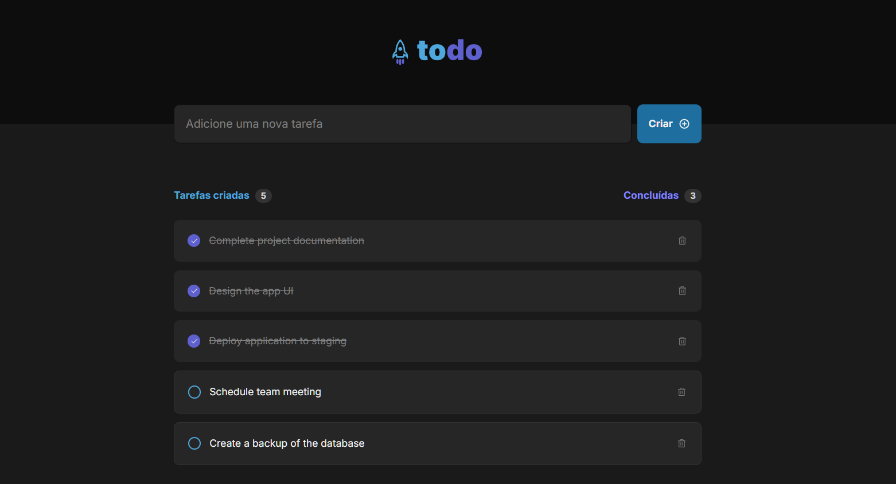

# Ultimate Todo List

This is a simple Todo List application built with React and CSS Modules. The design was inspired and assisted by Figma for the purpose of studying UI and design principles.

## Features

- **Add Tasks**: Easily add new tasks to your to-do list.
- **Mark as Completed**: Mark tasks as completed with a single click.
- **Remove Tasks**: Delete tasks from your list once they are done.
- **Responsive Design**: The app is responsive and works well on both desktop and mobile devices.

## Technologies Used

- **React**
- **CSS Modules**
- **Figma**

## Live Demo

You can check out the live version of the app here: [Ultimate Todo List](https://ultimate-todo-list.vercel.app/)
